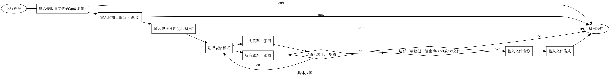

## 美股价格查询
查询范围时间内美股股价变化，将收盘价制成图表，数据可储存为excel或csv文件。

### 使用说明

#### 1. 需要安装的程序和包：

1. Python3  -- https://www.python.org/downloads/
2. pandas -- ```pip install pandas```
3. matplotlib -- ```pip install matplotlib```
4. yfinance -- ```pip install yfinance```


#### 2. 具体步骤：
1. 下载 stock.py
2. 运行程序：在terminal/命令行软件跳转至相应目录，输入 ```python -m stock```
3. 输入想查询美股的英文代码，起始日期、截止日期、表格模式、是否需要将数据写入文件...




###备注：
上传了jupyter notebook版本，有需要的同学可以下载.ipynb文件，用jupyter notebook或者jupyterlab改着玩.
